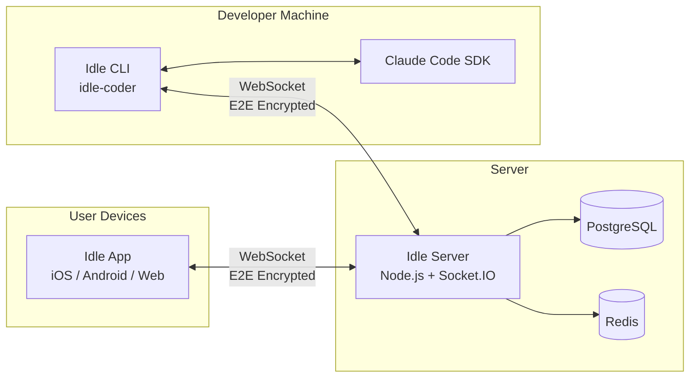
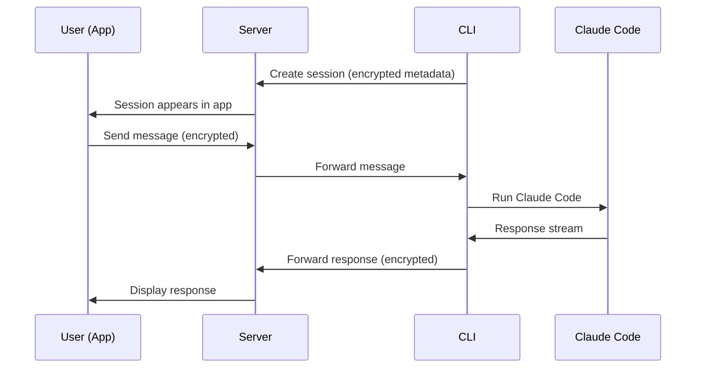

# Idle Architecture

## System Overview



## Data Flow

### Session Lifecycle



### Encryption

All session data is encrypted client-side using TweetNaCl before leaving the device. The server stores only encrypted blobs — it cannot read session content.

```
CLI encrypts → Server stores ciphertext → App decrypts locally
```

Key exchange happens during the QR code auth flow.

## Package Dependencies

```mermaid
graph TD
    WIRE[@northglass/idle-wire<br/>Shared Zod types]
    CLI[idle-coder<br/>CLI]
    APP[idle-app<br/>Mobile + Web]
    SRV[idle-server<br/>API Server]
    AGENT[@northglass/agent<br/>Agent CLI]

    CLI --> WIRE
    APP --> WIRE
    SRV --> WIRE
    AGENT --> WIRE
    CLI --> |Claude Code SDK| CLAUDE[Claude Code]
```

## Infrastructure

| Component | Technology | Hosting |
|-----------|-----------|---------|
| App | React Native (Expo) | App Store / Play Store / Web |
| CLI | Node.js / TypeScript | npm (idle-coder) |
| Server | Node.js / Socket.IO / Prisma | IONOS VPS (198.71.58.100) |
| Database | PostgreSQL | IONOS VPS (local) |
| Cache | Redis | IONOS VPS (local) |
| DNS/CDN | Cloudflare | Proxied |
| Domains | idle.northglass.io (app), api.idle.northglass.io (server) | Cloudflare |
