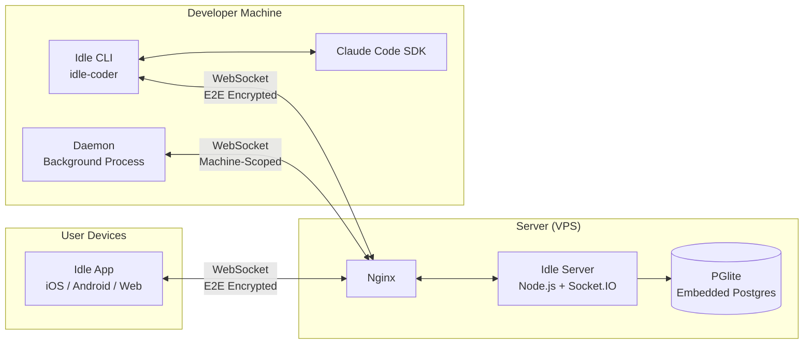

# Idle Architecture

## Domains

| Domain | Serves | What's There |
|--------|--------|-------------|
| `idle.northglass.io` | Web client | React Native app compiled to web (Expo static export). Full app — session list, message view, permissions, settings. Served by Nginx as static files. |
| `idle-api.northglass.io` | Backend API | Node.js server. REST endpoints (auth, sessions, files) + WebSocket relay (Socket.IO). All devices connect here. |

Both subdomains point to the same VPS via Cloudflare DNS (proxied). There is no marketing/landing page — `idle.northglass.io` IS the product.

## System Overview



## Traffic Flow: CLI → Server → iPhone

This diagram traces what happens when a user runs `idle` and views the session on their phone.

### 1. CLI Startup

```
$ idle
  │
  ├── Check if daemon is running (read daemon.state.json)
  │   └── If not: spawn `idle daemon start-sync` (detached background process)
  │       Daemon connects to server as machine-scoped WebSocket client
  │       Daemon runs HTTP control server on localhost:random for local IPC
  │
  ├── Generate 32-byte SESSION KEY (crypto random, unique per session)
  │   Encrypt session key with user's PUBLIC KEY (libsodium sealed box)
  │
  ├── POST /v1/sessions to server
  │   Body: { tag, metadata (encrypted), dataEncryptionKey (encrypted key blob) }
  │   Server stores encrypted key blob — cannot unwrap it
  │
  ├── Open WebSocket to idle-api.northglass.io
  │   Auth: { token, clientType: 'session-scoped', sessionId }
  │
  └── Start Claude Code subprocess
      Claude reads/writes the terminal
      All output captured by CLI for relay
```

### 2. Message Relay (CLI → Server → App)

```
TERMINAL                          SERVER                           iPHONE
────────                          ──────                           ──────

Claude generates output
"Here's the fix..."
        │
        ▼
CLI encrypts with SESSION KEY
AES-256-GCM(plaintext) → base64
        │
        ▼
Socket.IO emit('message', {
  sid: "session-123",
  message: "aW4gR29k...",        Server receives blob
  localId: "uuid"           ───▶  │
})                                │  ❌ Cannot decrypt
                                  │  Stores { t:'encrypted', c:'aW4g...' }
                                  │
                                  │  eventRouter broadcasts to
                                  │  all user-scoped connections
                                  │                                    │
                                  └──── Socket.IO 'update' event ────▶│
                                                                      │
                                                            Look up session key
                                                            (decrypted at app startup)
                                                                      │
                                                            AES-256-GCM decrypt
                                                                      │
                                                            Renders: "Here's the fix..."
```

### 3. App → CLI (Permissions, Messages)

The reverse flow — when you approve a permission request or send a message from your phone:

```
iPHONE                            SERVER                          TERMINAL
──────                            ──────                          ────────

User taps "Approve"
        │
Encrypt with SESSION KEY
        │
socket.emit('rpc-call', {
  method: 'session-123:         Routes encrypted RPC
    approve-permission',   ───▶  to CLI's WebSocket    ───▶  CLI decrypts
  params: encrypted(...)                                      Claude gets
})                                                            permission
                                                              and runs
```

### 4. Key Exchange (How iPhone Gets the Session Key)

The session key never travels in plaintext. The server stores an encrypted blob it cannot open.

```
CLI                              SERVER                          iPHONE
───                              ──────                          ──────

Generate sessionKey
(32 random bytes)
        │
Wrap with user's
PUBLIC KEY
(libsodium box)
        │
POST /v1/sessions ──────▶ Store encrypted blob
  { dataEncryptionKey:     as-is in database
    [ephPubKey|nonce|
     ciphertext] }
                                                        GET /v3/sessions
                           Return encrypted blob ──────▶ │
                                                         Decrypt with
                                                         PRIVATE KEY
                                                         (from master secret
                                                          in device keystore)
                                                                │
                                                         sessionKey recovered!
                                                         Cached in memory
        │                                                       │
        └───────── Encrypted messages flow both ways ───────────┘
                   Server relays but cannot read them
```

### 5. Daemon Architecture

The daemon is a long-lived background process that outlives individual CLI sessions:

```
┌─ Developer Machine ────────────────────────────────────────┐
│                                                            │
│  idle daemon start-sync (background, detached)             │
│  │                                                         │
│  ├── HTTP Control Server (localhost:random)                 │
│  │   ├── POST /session-started (CLI notifies daemon)       │
│  │   ├── POST /spawn-session (app requests new session)    │
│  │   ├── POST /stop-session (app stops a session)          │
│  │   ├── POST /list (enumerate active sessions)            │
│  │   └── POST /stop (graceful shutdown)                    │
│  │   Auth: Bearer token (random, stored in daemon.state)   │
│  │                                                         │
│  ├── WebSocket to server (machine-scoped)                  │
│  │   Receives RPC: "spawn session in /path/to/project"     │
│  │   from mobile app → daemon starts new CLI process       │
│  │                                                         │
│  └── Session Tracker                                       │
│      Tracks PIDs of child idle processes                   │
│      Health checks, orphan cleanup                         │
│                                                            │
│  idle (session 1) ← runs Claude Code subprocess            │
│  idle (session 2) ← runs Claude Code subprocess            │
│  idle (session 3) ← ...                                    │
└────────────────────────────────────────────────────────────┘
```

## What the Server Sees vs. Cannot See

| Data | Encrypted? | Server Can Read? |
|------|-----------|-----------------|
| Message content | AES-256-GCM | **No** — opaque blobs |
| Session metadata (title, summary) | AES-256-GCM | **No** |
| Claude agent state | AES-256-GCM | **No** |
| Service tokens (API keys) | privacy-kit | **No** |
| GitHub token | Encrypted Bytes | **No** |
| Session tag (name) | No | Yes — e.g., "Claude session #3" |
| Session ID | No | Yes — opaque UUID |
| User account ID | No | Yes — opaque identifier |
| Message sequence numbers | No | Yes — ordering only |
| Timestamps | No | Yes |
| Which machine a session runs on | No | Yes — machine ID |

See [encryption.md](encryption.md) for the full cryptographic specification.

## Package Dependencies

```mermaid
graph TD
    WIRE[@northglass/idle-wire<br/>Shared Zod types]
    CLI[idle-coder<br/>CLI]
    APP[idle-app<br/>Mobile + Web]
    SRV[idle-server<br/>API Server]
    AGENT[@northglass/agent<br/>Agent CLI]

    CLI --> WIRE
    APP --> WIRE
    SRV --> WIRE
    AGENT --> WIRE
    CLI --> |Claude Code SDK| CLAUDE[Claude Code]
```

## Infrastructure

| Component | Technology | Hosting | Notes |
|-----------|-----------|---------|-------|
| Web App | React Native (Expo) | idle.northglass.io (Nginx static) | PWA with manifest, installable |
| CLI | Node.js / TypeScript | npm (idle-coder) | Wraps Claude Code subprocess |
| Server | Node.js / Fastify / Socket.IO | idle-api.northglass.io | Standalone mode (PGlite) |
| Database | PGlite (embedded Postgres) | VPS local storage | Embedded, no external DB needed |
| DNS/CDN | Cloudflare (proxied) | Free plan | Full SSL mode |
| CI/CD | GitHub Actions | 5 workflows | test, typecheck, deploy-server, deploy-webapp, cli-smoke |

### Security Hardening

The production deployment uses standard Linux hardening:

- **Firewall**: Only ports 22, 80, 443 exposed
- **systemd isolation**: `ProtectSystem=strict`, `NoNewPrivileges=yes`, `PrivateTmp=yes`
- **Least privilege**: Deploy user with limited sudoers (systemctl restart/status only)
- **Reverse proxy**: Application port not externally exposed — Nginx reverse proxy only
- **Cloudflare WAF**: IP allowlist available for restricting access during alpha/beta
- **WebSocket**: Enabled at Cloudflare network settings for Socket.IO passthrough

See [deployment.md](deployment.md) for full self-hosting setup instructions.
